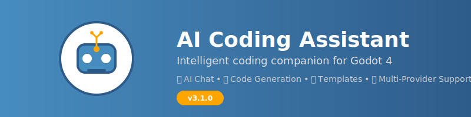
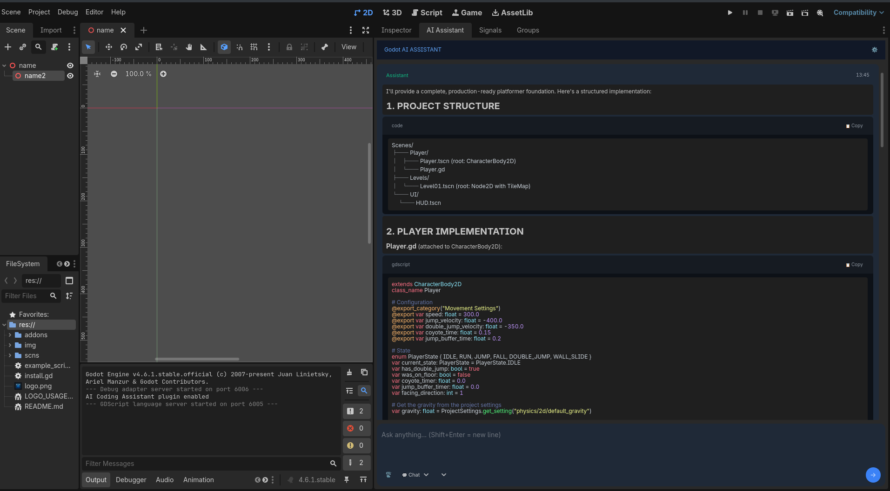

<div align="center">
  

# 🤖 AI Coding Assistant for Godot 4 — v3.0.0

[](https://godotengine.org/)
[](https://opensource.org/licenses/MIT)
[](https://github.com/Godot4-Addons/ai_assistant_for_godot/releases)

**A professional AI coding assistant plugin for Godot 4 with an agentic code system, syntax highlighting, and GitHub-style markdown rendering.**

</div>

<br>

<div align="center">
  
</div>

<br>



---

## ✨ What's New in v3.0.0

- � **Syntax Highlighting** — GDScript, Python, JS/TS, C#, Bash, C/C++ with a Dracula-inspired palette
- 📦 **GitHub-Style Code Blocks** — Dark containers with rounded corners, language labels, and a 📋 **Copy** button
- 🧠 **Full Agentic System** — Multi-tool AI agent with project context, file patching, and semantic search
- � **Modular Persona System** — Swappable expert personas (Chat, Plan, Code)
- 📝 **Enhanced Markdown Rendering** — Fenced code blocks, nested lists, tables, blockquotes, checkboxes
- � **Permission Manager** — Approve or deny AI file operations
- ⚡ **Performance** — Intelligent caching, streaming without freezes, loop guards

### ⚠️ Known Limitations

- **Code/Auto mode** is not fully developed yet — may produce incomplete results on complex multi-file tasks
- **Streaming** shows plain text until finalized (no live markdown rendering)
- **HuggingFace & Cohere** providers are less tested than Gemini

---

## 🚀 Quick Start

### 1. Install

```bash
git clone https://github.com/Godot4-Addons/ai_assistant_for_godot.git
cp -r ai_assistant_for_godot/addons/ai_coding_assistant your_project/addons/
```

### 2. Enable

1. Open your Godot project → **Project Settings > Plugins**
2. Enable **AI Coding Assistant**
3. The assistant dock appears in the editor

### 3. Configure

1. Click **⚙ Settings** in the dock
2. Select a provider (Gemini recommended)
3. Enter your API key — start coding!

---

## 🎯 Core Features

### 🧠 Agentic AI System

| Feature                | Description                                                |
| ---------------------- | ---------------------------------------------------------- |
| **Multi-Tool Agent**   | Reads files, patches code, runs searches, creates files    |
| **Project Context**    | Automatically builds a blueprint of your project structure |
| **Semantic Search**    | Finds relevant code across your codebase                   |
| **Loop Guard**         | Prevents runaway agent loops with configurable limits      |
| **Permission Manager** | Review and approve AI file operations                      |

### 🎨 Syntax Highlighting

| Language      | Keywords | Types | Strings | Comments | Functions |
| ------------- | -------- | ----- | ------- | -------- | --------- |
| GDScript      | ✅       | ✅    | ✅      | ✅       | ✅        |
| Python        | ✅       | ✅    | ✅      | ✅       | ✅        |
| JavaScript/TS | ✅       | ✅    | ✅      | ✅       | ✅        |
| C#            | ✅       | ✅    | ✅      | ✅       | ✅        |
| Bash/Shell    | ✅       | —     | ✅      | ✅       | ✅        |
| C/C++         | ✅       | ✅    | ✅      | ✅       | ✅        |

### 📝 Markdown Rendering

- **Headers** (H1–H6) with configurable font sizes
- **Fenced code blocks** with language detection and syntax coloring
- **GitHub-style code containers** — dark panel, border, language label, copy button
- **Ordered & unordered lists** with nesting
- **Tables** with header formatting
- **Blockquotes**, **horizontal rules**, **checkboxes**
- **Inline formatting** — bold, italic, underline, strikethrough, code spans
- **Links & images**

### 🔌 AI Providers

| Provider        | Model            | Notes                         |
| --------------- | ---------------- | ----------------------------- |
| **Gemini**      | gemini-2.0-flash | Recommended — fast & accurate |
| **HuggingFace** | Various          | Free tier available           |
| **Cohere**      | Command series   | Enterprise-grade              |
| **OpenRouter**  | Multiple         | Access to many models         |

---

## 🏗️ Architecture

```
addons/ai_coding_assistant/
├── agent/               # Agentic AI system
│   ├── agent_loop.gd    # Main agent execution loop
│   ├── agent_context.gd # Project context builder
│   ├── agent_memory.gd  # Conversation memory
│   ├── tool_registry.gd # Tool definitions & execution
│   ├── loop_guard.gd    # Safety limits
│   └── permission_manager.gd
├── persona/             # Modular persona system
│   ├── persona_manager.gd
│   ├── chat_persona.gd
│   ├── code_persona.gd
│   └── plan_persona.gd
├── markdownlabel/       # Markdown rendering engine
│   ├── markdownlabel.gd # RichTextLabel extension
│   ├── markdown_parser.gd
│   └── syntax_highlighter.gd
├── ui/                  # UI components
│   ├── ai_assistant_dock.gd
│   ├── chat_message.gd  # GitHub-style message rendering
│   └── ui_theme.gd
└── editor/              # Editor integration
    └── editor_reader.gd
```

---

## 📱 Responsive Layout

| Screen Size             | Layout   | Features                        |
| ----------------------- | -------- | ------------------------------- |
| **Large (>1000px)**     | Expanded | Full features, generous spacing |
| **Medium (600–1000px)** | Balanced | Optimized for productivity      |
| **Small (400–600px)**   | Compact  | Auto-collapse, space efficient  |
| **Mobile (<400px)**     | Minimal  | Essential functions only        |

---

## ️ Development

### Requirements

- Godot 4.x (4.0+)
- Internet connection for AI features
- API key from a supported provider

### Contributing

1. Fork the repository
2. Create a feature branch
3. Make your changes
4. Submit a pull request

---

## � License

MIT License — see [LICENSE](LICENSE) for details.

## � Credits

- **Godot Engine** — Juan Linietsky, Ariel Manzur & Contributors
- **MarkdownLabel** — Based on [daenvil/MarkdownLabel](https://github.com/daenvil/MarkdownLabel) (MIT)
- **Logo & Design** — [Grandpa EJ](https://github.com/gpbot-org)
- **AI Providers** — Google (Gemini), HuggingFace, Cohere, OpenRouter

---

<div align="center">

**Made with ❤️ for the Godot community by [Grandpa EJ](https://github.com/grandpaej)**

_Transform your Godot development with professional AI assistance!_ 🚀

</div>
